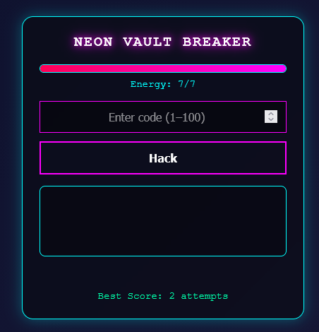
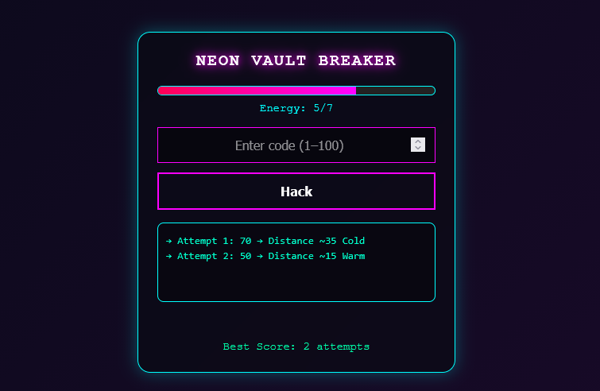
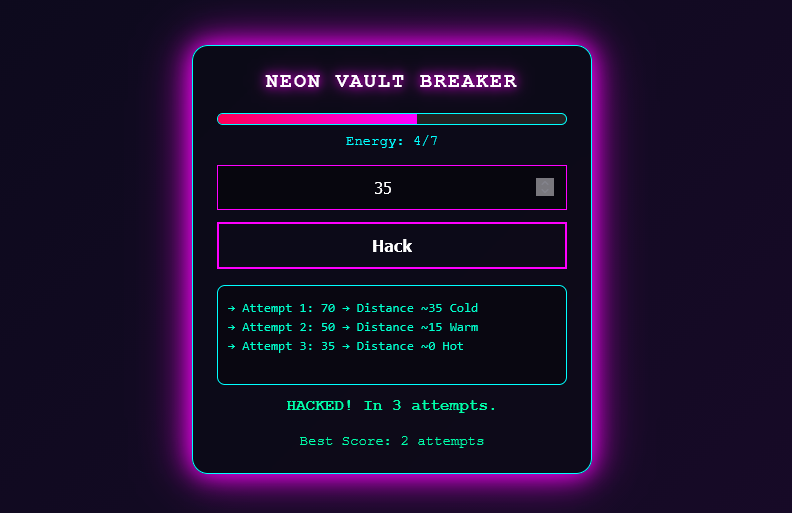

## Neon Vault Breaker

A simple educational mini-project built with HTML, CSS, and JavaScript.
The game is based on the classic “Hot & Cold” guessing mechanic, styled with a neon aesthetic.

# About 

This project was created as a small practice exercise to improve basic frontend skills.

The goal is simple:

Guess the hidden number
Get feedback: “Hot” (close) or “Cold” (far)
Keep trying until you find the correct answer
## Preview

  
  

  

---
## How to Run
1 - Easy Way 

Download or clone the repository

Open the folder

Run the index.html file in your browser

2 - Git 
git clone https://github.com/soykoulen/Neon-Vault-Breaker.git
cd neon-vault-breaker

Then open index.html in your browser.

# Tech Stack
* HTML
* CSS 
* JavaScript
## Purpose
This is a learning project, created to practice:

DOM manipulation

Basic game logic

UI feedback interaction
